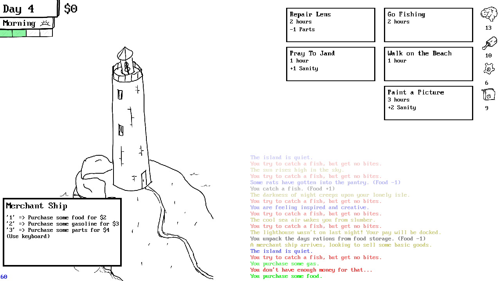

# Lighthouse Keeper
Made in 48 hours for Ludum Dare 46.
The code is a nightmare - tons of global state, dead code, and questionable logic.

  

## Compiling and Running
`cargo run --release`

## License
[zlib license](LICENSE.md)